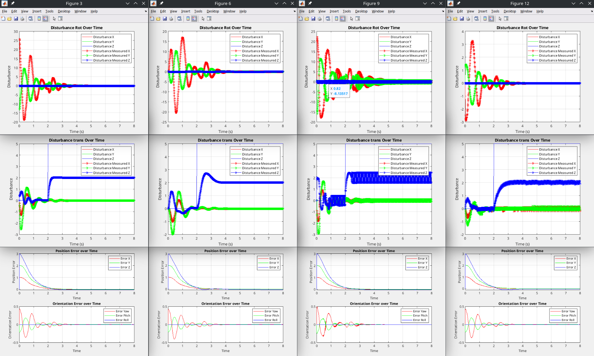

# DroneModelBase_matlabScripting

## Overview

This repository contains MATLAB scripts and classes for simulating the dynamics, control, and observer behavior of a quadrotor. The simulation framework is modular, enabling easy extension and integration of new controllers, estimators, and observers.



## Features

- Simulates quadrotor dynamics, including translational and rotational motion.
- Implements a quaternion-based PD controller.
- Modular design for adding custom controllers and observers.
- Built-in scripts for comparing various observer techniques.
- Data logging and result analysis for trajectory tracking and observer performance.

## Project Structure

```
.
├── Drone.m                    # Main class for quadrotor dynamics and control logic
├── DroneDynamic.m             # Handles the physical dynamics of the quadrotor
├── DroneDataExtention.m       # Data logging and visualization utilities
├── ObserverBase.m             # Base class for implementing observers
├── Kalman.m                   # Kalman Filter implementation
├── Luenberger.m               # Luenberger Observer implementation
├── SlidingModeEstimator.m     # Sliding Mode Observer implementation
├── SuperTwistEstimator.m      # Super-Twist Observer implementation
├── UDE.m                      # Uncertainity and Disturbance Estimator implementation
├── SoftTrajectoryGenerator.m  # Trajectory generation class
├── simObsComparation.m        # Script for comparing observer performance
├── simDrone.m                 # Main simulation script for quadrotor dynamics
├── simLuenberger.m            # Simulation script for Luenberger Observer
├── simSM.m                    # Simulation script for Sliding Mode Observer
├── simST.m                    # Simulation script for Super-Twist Observer
├── simUDE.m                   # Simulation script for UDE Observer
├── p_noisy.csv                # Sample noisy data for testing Kalman filter
├── ResultsAnalysis.m          # Script for analyzing simulation results
└── README.md                  # Project documentation
```

## How to Run the Simulations

### 1. Compare Observer Performance
Run the **`simObsComparation.m`** script to simulate and compare the performance of different observers.

### 2. Simulate Specific Observers
Use one of the following scripts to simulate the performance of individual observers:
- `simLuenberger.m`
- `simSM.m`
- `simST.m`
- `simUDE.m`

### 3. General Quadrotor Simulation
Run **`simDrone.m`** for a general simulation of quadrotor dynamics, control, and trajectory following.

## Adding Custom Modules

### Extending Controllers or Observers
To implement new controllers or observers:
1. Create a new class inheriting from the appropriate base class (`Drone` or `ObserverBase`).
2. Override or implement methods for your custom logic.

### Adding New Plots
To visualize additional data:
1. Add a new property in `DroneDataExtention` for storing the data.
2. Update the methods in `DroneDataExtention` to handle and plot the new data.

## Related Implementation

This simulation framework is designed to complement the **[SimpleControl](https://github.com/Ineso1/SimpleControl)** repository, which provides a real-time implementation of quadrotor control and observer logic using C++ and the FL-AIR framework.
